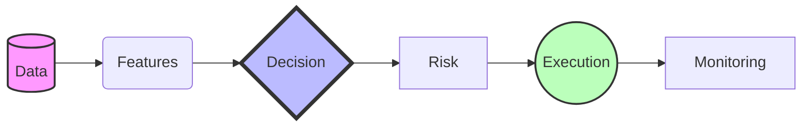
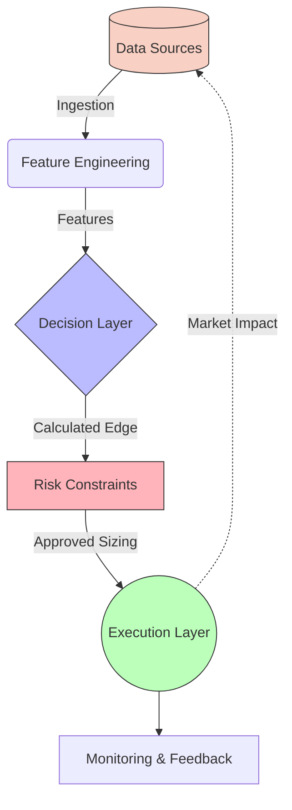

  <h1>⎋ AI Decision Systems Portfolio</h1>
  
<b>Production AI systems executing real-time decisions under latency, capital, and risk constraints</b>

  
  
  
  

 

## 🧠 Overview

This repository showcases **production-grade AI decision systems** that convert real-time data into **actionable execution**. The focus is on **systems that make decisions and act on them**, not models in isolation.

> ⚠️ **These are not experiments.**  
> They are **live system architectures** designed to operate under strict **latency, capital, and risk constraints**.

---

## 🎯 Portfolio Structure

<table>
  <tr>
    <td width="50%" valign="top">
      <h3>☑︎ Capital Decision Systems</h3>
      
Systems that <b>directly generate capital growth.</b>

    </td>
    <td width="50%" valign="top">
      <h3>⚛︎ Supporting Infrastructure</h3>
      
Systems that enable <b>data, execution, and system reliability.</b>

    </td>
  </tr>
</table>

---

# ☑︎ Capital Decision Systems

## 1. Easy ORB 0DTE — High-Frequency Capital Allocation System
*Primary production system for capital growth*

A cloud-deployed execution system that:
- 📊 Captures opening range breakout (ORB) structures  
- ⏱️ Evaluates tradeability in real-time  
- ⚡ Executes ETF + 0DTE options trades  

**Key Capabilities:**
- **Scale:** 36,786 lines of production code
- **Logic:** Dual-strategy system (ETF + options overlay) with 14+ automated exit conditions
- **Pricing:** Real-time options pricing (30s updates)
- **Risk:** ADV-based position sizing + risk gating

<b>📈 Performance (Validated Backtesting)</b>

 

| Metric | Result |
| :--- | :--- |
| **Weekly Return** | +73.69% |
| **Winning Day Consistency** | 91% |
| **Drawdown Reduction** | 96% |

<b>🛠️ Product Decisions & Insights</b>

 

- 🛡️ Prioritized **capital preservation** over max gain.
- 🚧 Enforced **strict execution gating** over signal chasing.
- ⚖️ Balanced **latency vs. decision quality** under volatility.

> **Insight:** A real system for **decision-making under extreme constraints** (minutes-level timing, capital exposure, volatility uncertainty).

---

## 2. Easy Kalshibot — Prediction Market Decision System
*A probabilistic decision system for event-driven markets.*

**Core Concepts:**
- 🎲 **Edge Detection:** Probability vs. market pricing 
- 🔄 **Updates:** Bayesian updates from new information  
- 💰 **Allocation:** Kelly-based capital placement  

**Demonstrates:** Decision-making under uncertainty, probability-driven execution, and risk-adjusted capital deployment.

> **Insight:** Markets are treated as **probability surfaces**, not price charts.

---

## 3. Ultima Bot — AI Decision Platform
*A full-stack AI system orchestrating discovery, scoring, forecasting, risk management, and execution.*

**Core Pipeline:**

**Key Capabilities:**
- 🏦 Multi-broker + DeFi wallet execution
- 🧠 ML model orchestration (7+ production models)
- ⚡ Real-time WebSocket system (<100ms latency)
- 📈 Confidence-based capital scaling

> **Role:** The **unified decision platform** that integrates data pipelines, models, and execution systems into a single operating system for capital allocation.

---

# ⚛︎ Supporting Infrastructure

## 4. Easy TradingView Agent — Execution Layer
*A production-grade system converting signals → broker execution.*

- **Webhook Pipeline:** Automated end-to-end execution
- **Multi-broker Routing:** With virtual partition system
- **Reliability:** Idempotent execution + reconciliation

> **Role:** Ensures **decision → execution reliability**. *(Not a strategy system)*

---

## 5. Easy Collector — Data & Feature Pipeline
*A cloud-native pipeline for ML training and feature generation.*

- **Ingestion:** Real-time data via Polygon, Coinbase
- **Labeling:** Edge-based labeling formula:  
  `edge = MFE - (k * MAE) - cost_penalty`
- **Efficiency:** 98% API cost reduction through idempotent storage caching

> **Role:** Provides **ML-ready datasets**. *(Not a trading system)*

---

# 🏗️ Architecture Philosophy

### Core Principles
- 🎯 **Decisions > predictions:** Models must trigger action.
- 🚧 **Constraints define reality:** Latency, capital, and risk bound the solution space.
- ⚙️ **Deterministic execution:** Verifiable and strictly monotonic state transitions.
- 🧩 **Separation of concerns:** Data, strategy, risk, and execution are decoupled.
- 🛡️ **Fail-safe systems:** Graceful degradation is a primary requirement.

---

# 📊 Portfolio Scale

  
  
  

 

**Multi-system architecture seamlessly spans across:**
- ⚡ Execution Systems
- 🧠 ML Pipelines
- 💻 Full-Stack Applications

---

# 🎯 Target Roles

This portfolio powerfully advocates for capability in:
- 🥇 **Senior Technical Product Manager (AI/ML)**
- 🥈 **AI Platform Product Manager**
- 🥉 **Decision Systems / Infrastructure PM**

---

# 🧠 Core Thesis

  <h3><em>"AI systems that matter are not models."</em></h3>
  
They are <b>decision systems operating under constraints</b>.

---

  
## 🚀 Contact
  
   
   
  
  

